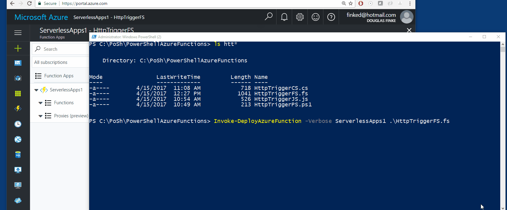

# ServerlessPowerShell
PowerShell module that let's you easily deploy PowerShell scripts (and more) as Azure http trigger functions.

Saw this https://github.com/wbuchwalter/azul and built this.

## Deploy and Test PowerShell Azure Function

## Deploy and Test F# Azure Function

## Deploy Multiple Azure Functions
`C#`, `F#`, `JavaScript`, and `PowerShell`

